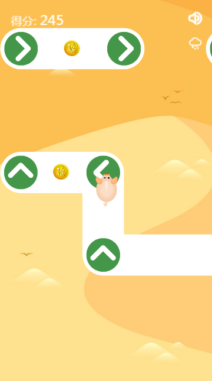

# PigPigRun Project

## 福利会小游戏 - 猪猪快跑
游戏基于 [phaser3](http://phaser.io)，除游戏主体外其他均是 html，各个页面的切换是控制 div 显示/隐藏。
在平安夜加入了圣诞DLC，主要内容为添加飘雪、添加一个圣诞关卡。

游戏用于2018年福利会引流，项目中涉及公司内部资料的已删除或替换
## 在线访问
> [测试地址 http://undefined.ga](http://undefined.ga)

> [2018年活动地址](http://tm.lilanz.com/supersale/2018/pig/build/index.aspx)

## 先看东西
### 主页


### 第六关

### 圣诞DLC

### 游戏截图（5MB gif）


## 说明

## 文件结构
```text
D:.
│  .babelrc
│  .gitignore
│  package.json
│  README.md
│  webpack.config.js
│  webpack.production.config.js
│  yarn.lock
│
├─autoTask                      // 自动化任务目录
│      aspxTpl.aspx             // aspx 模版
│      AutoTask.js
│      copyDist.bat
│      copyIgnore.txt
│      gulpfile.js
│      index.js
│      package.json
├─build                       // 打包后目录
├─mockServer                  // mock 服务器目录
│  │  app.js
│  │
│  ├─bin
│  │      www
│  │
│  ├─public
│  │  │  index.html
│  │  ├─images
│  │  ├─javascripts
│  │  └─stylesheets
│  └─routes
│          index.js // mock 返回
│
├─resource                      // 资源文件目录
│  ├─audio  // 游戏声音资源
│  ├─iconfont
│  ├─image  // 游戏使用图片
│  │  ├─icon
│  │  └─prize                  // 礼品图片目录
│  └─maps                      // 地图文件目录
├─screenshot                   // 截图目录
└─src
    │  index.html
    │  index.js
    │
    ├─api
    ├─css
    ├─js
    │      js.js    // 控制 dom
    │      snow.js  // 飘雪
    │
    ├─lib                      // 使用的第三方库
    │      dialog.css
    │      dialog.js
    │      flexible.min.js
    │      phaser.min.js
    │      resLoader.js
    │      vconsole.min.js
    │      zepto.min.js
    │
    ├─object                    // 游戏对象
    │      Arrow.js
    │      Coin.js
    │      Player.js
    │
    └─scene
            pigLevelScene.js    // 主游戏场景
            preloadScene.js     // 预加载场景
```